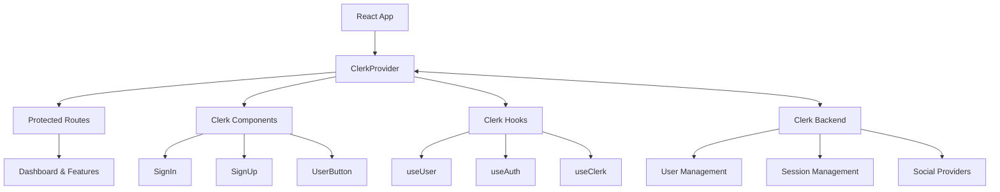
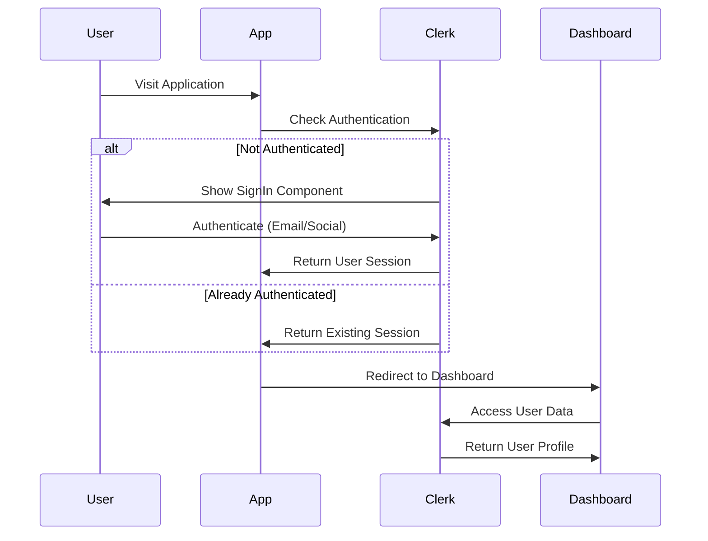

# Design Document

## Overview

This design outlines the integration of Clerk authentication into the Krushikara Balaga AI Agronomist application. The implementation will replace the current custom authentication system with Clerk's robust authentication platform, providing secure user management, social logins, and enhanced security features while preserving the application's existing user profile functionality and UI consistency.

## Architecture

### High-Level Architecture



### Authentication Flow



## Components and Interfaces

### Core Components

#### 1. ClerkProvider Setup
- **Purpose**: Initialize Clerk with configuration and wrap the entire application
- **Location**: `index.tsx` or `App.tsx`
- **Configuration**: 
  - Publishable key from environment variables
  - Appearance customization for theme support
  - Localization settings

#### 2. Authentication Components
- **SignInPage**: Replace current Auth component with Clerk's SignIn
- **SignUpPage**: Dedicated signup page using Clerk's SignUp component
- **UserButton**: Replace current profile/logout buttons with Clerk's UserButton

#### 3. Protected Route Wrapper
- **Purpose**: Protect application routes using Clerk's authentication state
- **Implementation**: Higher-order component or route guard
- **Fallback**: Redirect to SignIn when not authenticated

#### 4. User Profile Integration
- **Purpose**: Sync agricultural profile data with Clerk's user metadata
- **Storage**: Use Clerk's public metadata for profile information
- **Fields**: name, location, farming preferences, usage analytics

### Hook Replacements

#### Current vs New Implementation

| Current Hook | Clerk Replacement | Purpose |
|--------------|-------------------|---------|
| `useAuth()` | `useAuth()` from Clerk | Authentication state |
| `user` from AuthContext | `useUser()` | Current user data |
| `login()` | Clerk's SignIn component | User login |
| `logout()` | `clerk.signOut()` | User logout |
| `signup()` | Clerk's SignUp component | User registration |
| `updateUser()` | `user.update()` | Profile updates |

### Data Models

#### User Profile Schema
```typescript
interface ClerkUserProfile {
  // Clerk's built-in fields
  id: string;
  emailAddresses: EmailAddress[];
  firstName?: string;
  lastName?: string;
  imageUrl: string;
  
  // Custom metadata for agricultural app
  publicMetadata: {
    location?: string;
    farmingType?: string;
    experienceLevel?: string;
    preferredLanguage?: 'en' | 'kn';
    profileCompleted?: boolean;
  };
  
  // Private metadata (if needed)
  privateMetadata: {
    analyticsId?: string;
    lastLoginDate?: string;
  };
}
```

#### Migration Data Structure
```typescript
interface LegacyUserData {
  name: string;
  email: string;
  location: string;
  // Additional fields from current system
}

interface MigrationMapping {
  legacyField: string;
  clerkField: keyof ClerkUserProfile | string;
  transform?: (value: any) => any;
}
```

## Error Handling

### Authentication Errors
- **Network Issues**: Display retry mechanism with user-friendly messages
- **Invalid Credentials**: Show Clerk's built-in error messages
- **Social Login Failures**: Provide fallback to email/password authentication
- **Session Expiry**: Automatic redirect to SignIn with context preservation

### Profile Sync Errors
- **Metadata Update Failures**: Retry mechanism with local state backup
- **Migration Errors**: Graceful fallback to manual profile completion
- **Validation Errors**: Clear field-level error messages

### Error Boundaries
```typescript
interface AuthErrorBoundary {
  fallback: React.ComponentType<{error: Error}>;
  onError: (error: Error, errorInfo: ErrorInfo) => void;
  resetOnPropsChange?: boolean;
}
```

## Testing Strategy

### Unit Tests
1. **Clerk Integration Tests**
   - Mock Clerk hooks and components
   - Test authentication state changes
   - Verify user profile data handling

2. **Component Tests**
   - Protected route behavior
   - User profile synchronization
   - Theme and language integration

3. **Hook Tests**
   - Custom hooks that interact with Clerk
   - Profile update functionality
   - Error handling scenarios

### Integration Tests
1. **Authentication Flow**
   - Complete login/logout cycles
   - Social authentication flows
   - Profile creation and updates

2. **Data Migration**
   - Legacy user data migration
   - Profile field mapping
   - Error recovery scenarios

### E2E Tests
1. **User Journeys**
   - New user registration and onboarding
   - Existing user login and profile access
   - Multi-language authentication flows

2. **Cross-browser Testing**
   - Authentication across different browsers
   - Session persistence testing
   - Social login compatibility

## Implementation Phases

### Phase 1: Core Integration
- Install and configure Clerk
- Replace AuthContext with Clerk providers
- Implement basic authentication flow
- Update main App component

### Phase 2: Component Migration
- Replace Auth component with Clerk components
- Update protected routes
- Implement user profile synchronization
- Handle existing user data migration

### Phase 3: UI/UX Enhancement
- Apply theme customization
- Implement language localization
- Style Clerk components to match app design
- Add loading states and error handling

### Phase 4: Advanced Features
- Implement user metadata management
- Add analytics integration
- Set up user management dashboard access
- Optimize performance and bundle size

## Security Considerations

### Environment Variables
- Store Clerk keys securely in environment variables
- Use different keys for development/production
- Implement proper key rotation procedures

### User Data Protection
- Use Clerk's built-in security features
- Implement proper metadata access controls
- Ensure GDPR compliance for user data

### Session Management
- Leverage Clerk's secure session handling
- Implement proper token refresh mechanisms
- Handle session expiry gracefully

## Performance Considerations

### Bundle Size Optimization
- Import only necessary Clerk components
- Use dynamic imports for authentication pages
- Implement code splitting for auth-related code

### Loading States
- Show loading indicators during authentication
- Implement skeleton screens for user data loading
- Optimize initial app load time

### Caching Strategy
- Cache user profile data appropriately
- Implement offline-first approach where possible
- Use Clerk's built-in caching mechanisms